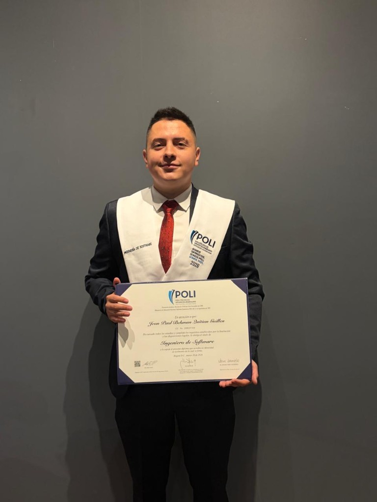

# Jean Paul Quitian — Portafolio Web

Portafolio personal de **Jean Paul Quitian**, Ingeniero de Software y Desarrollador Backend Python especializado en automatización con IA.

**Sitio en vivo:** [devjeanpaul.com](https://devjeanpaul.com)

---

## Sobre mí

Desarrollador backend en Python con experiencia en integraciones OpenAI, APIs REST, Docker, bases de datos relacionales y automatización de procesos con n8n, SharePoint y Airtable. Actualmente en **GeoPark** como AI Automation Engineer.

## Vista previa



## Secciones del sitio

| Sección | Descripción |
|---------|-------------|
| **Inicio** | Presentación, foto profesional y enlaces rápidos |
| **Sobre mí** | Resumen profesional e idiomas |
| **Experiencia** | GeoPark, Periferia IT Group (Python & DevOps) |
| **Proyectos** | Automatización IA, APIs Django, CI/CD DevSecOps |
| **Habilidades** | Backend, IA, DevOps/Cloud y Frontend |
| **Educación** | Ingeniería de Software, SENA y certificaciones |
| **Contacto** | Email, teléfono, LinkedIn, GitHub y CV |

## Stack tecnológico

- **Frontend:** HTML5, CSS3, JavaScript
- **Animaciones:** AOS (Animate On Scroll)
- **Iconos:** Font Awesome
- **Tipografía:** Exo (Google Fonts)
- **Deploy:** GitHub Pages

## Habilidades destacadas

`Python` · `Django` · `OpenAI / GPT` · `Claude` · `Cursor` · `Docker` · `Vercel` · `CI/CD` · `Azure` · `AWS` · `PostgreSQL` · `n8n`

## Contacto

- **Email:** j.guillen.0612@gmail.com
- **Teléfono:** (+57) 312 454 1612
- **LinkedIn:** [jean-paul-12qg](https://www.linkedin.com/in/jean-paul-12qg/)
- **GitHub:** [Jean-Paul-12](https://github.com/Jean-Paul-12)

## Ejecutar localmente

```bash
# Clonar el repositorio
git clone https://github.com/Jean-Paul-12/Portfolio.git
cd Portfolio

# Servidor local (Python)
python -m http.server 8080
```

Abre [http://localhost:8080](http://localhost:8080) en tu navegador.

## Estructura del proyecto

```
Portfolio/
├── index.html          # Página principal
├── styles/
│   └── style.css       # Estilos personalizados
├── scripts/
│   └── main.js         # Navegación, scroll spy, AOS
├── components/
│   ├── img/            # Imágenes y logos
│   └── cv/             # CV descargable (gitignored)
└── CNAME               # Dominio personalizado
```

---

© 2026 Jean Paul Quitian
